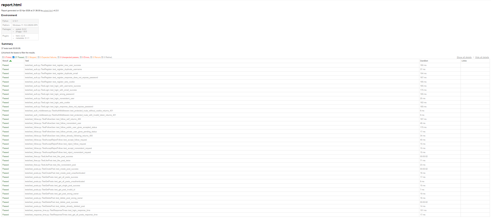

# Instagram API Test Suite

Automated API testing framework for an Instagram Clone backend using **Python**, **Pytest**, and **Requests**.

## 🚀 Features Tested

- User Registration
- User Login
- Protected Route Authorization
- Post Creation & Retrieval
- Post Deletion
- Like Functionality
- Follow / Unfollow Logic
- Accept / Reject Follow Requests
- Response Time Validation

## 🛠️ Tech Stack

- Python
- Pytest
- Requests
- Pytest HTML

## 📂 Project Structure

instagram-api-tests/
│
├── tests/
│ ├── conftest.py
│ ├── test_auth.py
│ ├── test_auth_middleware.py
│ ├── test_posts.py
│ ├── test_likes.py
│ ├── test_follow.py
│ ├── test_response_time.py
│ └── test_data.py
│
├── utils/
│ ├── config.py
│ ├── helpers.py
│ └── **init**.py
│
├── test_assets/
│ └── test_image.jpg
│
├── reports/
│ └── report.html
│
├── requirements.txt
├── pytest.ini
└── README.md

## ⚙️ Setup Instructions

### 1. Clone the repo

```bash
git clone <your-repo-link>
cd instagram-api-tests
```

<<<<<<< HEAD
## 📸 Test Report Preview


=======


>>>>>>> af2360acb5b6880ac0853931953999adabf9cb20
